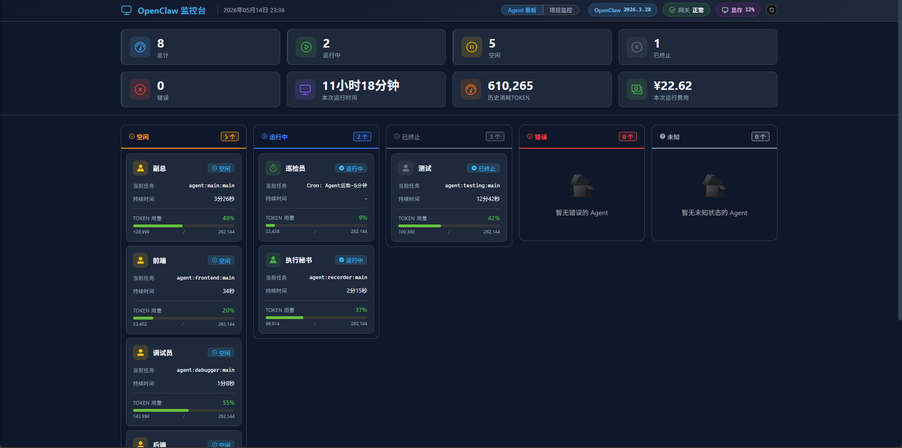

# 说明
这是一个基于 Vue 3 + Element Plus 的 OpenClaw 系统监控 Dashboard。
它通过 OpenClaw 系统的 API 实时获取数据，显示 OpenClaw 系统的 Agent 状态、运行时间、错误信息等。
用户可以通过该界面监控 OpenClaw 系统的运行状态。
必须先启动 OpenClaw 系统，才能使用该 Dashboard。

# 系统界面



# 启动

**Windows**：运行 `start.bat` 或 `start.sh`

**MacOS**：运行 `start.sh`

# 配置
在 `.env` 文件中配置 OpenClaw 系统的 API 地址、Token、电费单价、OpenClaw 版本、Agent 中文称呼等。

请参考 [env.example](.env.example)。

如果需要自定义 Agent 中文称呼，需要在 `.env` 文件中添加对应的变量名，格式为 `VITE_AGENT_<id>=<中文名称>`（id 中连字符用下划线替换）。

> 如果 `.env` 不存在，则将 `.env.example` 重命名为 `.env` 即可

# 注意
Openclaw 的版本必须在 2026.3.28 以上。

# 安装指南
## 下载并安装NodeJS
[点击此处下载NodeJS](https://nodejs.org/dist/v24.15.0/node-v24.15.0-x64.msi)

下载完成后按双击安装，一直点击下一步即可

## 安装OpenClaw
在终端执行 `npm i -g openclaw`

# llama.cpp 配置文件
```
@echo off
chcp 65001 >nul
echo ========================================
echo   Qwen3.6-27B GPU Server (RTX 5090 优化版)
echo   显存：~28/32 GB (88%)
echo   上下文：512K/agent (超大上下文)
echo   并发：1 slot (单任务模式)
echo   线程：24 (性能优化)
echo ========================================
echo.

set LLAMA_PATH=d:\llama\llama-b8863-bin-win-cuda-12.4-x64
set MODEL_PATH=d:\llama\model
set MODEL_NAME=Qwen3.6-27B-UD-Q4_K_XL
set PATH=%LLAMA_PATH%;%PATH%
set CUDA_VISIBLE_DEVICES=0
set LLAMA_BACKENDS=CUDA
set GGML_CUDA_ENABLE=1

"%LLAMA_PATH%\llama-server.exe" ^
 --model "%MODEL_PATH%\%MODEL_NAME%\%MODEL_NAME%.gguf" ^
 --mmproj "%MODEL_PATH%\%MODEL_NAME%\mmproj-BF16.gguf" ^
 --host 0.0.0.0 ^
 --port 8080 ^
 --n-gpu-layers 999 ^
 --ctx-size 524288 ^
 --batch-size 512 ^
 --ubatch-size 256 ^
 --threads 24 ^
 --flash-attn on ^
 --cache-type-k q4_0 ^
 --cache-type-v q4_0 ^
 --no-mmap ^
 --slot-save-path "slots" ^
 --reasoning-format deepseek ^
 --sleep-idle-seconds -1 ^
 -np 1 ^
 -cb ^
 --no-context-shift ^
 --parallel 1 ^
 --timeout 180 ^
 --log-file server.log ^
 -v

pause
```

# 联系作者
